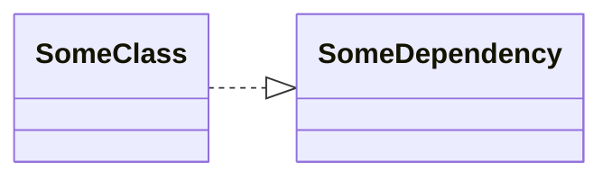

# DIフレームワークについて

Doinject は、DIコンテナを使って、アプリケーションを実装するためのフレームワークです。

DI とは、Dependency Injection の略で、依存性の注入という意味です。
これを実現するために、DIコンテナという部品が使われています。

DIフレームワークを理解するには、

* 制御の反転
* 依存関係の逆転

この二点の理解をしておくことが重要なので、すこし座学をしてみましょう。


こんなコードがあるとします。

```csharp
class SomeClass
{
    private readonly SomeDependency dependency;
    public SomeClass()
    {
        var context = ContextManager.Instance.Get();
        var playerName = PlayerRepository.Instance.GetPlayer().Name;
        dependency = new SomeDependency(context, playerName);
    }
}
```

SomeClass はコンストラクタで SomeDependency を new していて、SomeClass が SomeDependency に依存しています。



SomeClass は、SomeDependency について、その生成手順まで知らなければなりませんし、
SomeDependency を必要とする他のクラスがある場合、ここで書かれているような生成処理が同様に書かれることになるでしょう。

SomeDependency の生成手順が、後から変更されたら、すべてのコピペコードを一つ一つ修正していく必要がありそうです。
これは、つらい局面です。

そこで、SomeDependency のインスタンス生成は、余所の誰かに任せてしまいましょう。
new するのではなく、コンストラクタの引数で渡してもらうようにしてみます。

```csharp
class SomeClass
{
    private readonly SomeDependency dependency;
    public SomeClass(SomeDependency dependency)
    {
        this.dependency = dependency;
    }
}
```

すっきりしました。 このように、依存するオブジェクトを自分で new するのではなく、外から渡してもらうようにすることを
Dependency Injection(依存の注入)と言います。

> [!note]
> コンストラクタでインスタンスを受け取るものを「コンストラクタインジェクション」
> メソッドを通してインスタンスを受け取るものを「メソッドインジェクション」と言います。

このように、DI フレームワークを使うと、一例としてファクトリとしての役目を担ってもらうことがわかります。

## 制御の反転

new を「呼び出して」インスタンスを獲得していたコードは、コンストラクタが「呼び出される」ことでインスタンスを得ることになりました。
「呼び出す(Call)」から「呼び出される(Callback)」に変化したということです。
これを、制御の反転(Inversion of Control)と言い、DIフレームワークの重要な特徴となっています。

## 依存関係の逆転

DI は、依存関係逆転の原則(Dependency Inversion Principle)を実現するためにも利用されます。
先のコードは、制御こそ反転したものの、SomeDependency への依存があること自体変化はしていません。
つぎは、このクラス間の依存関係に手を加えてみましょう。

次の例を考えてみます。

```csharp
public class SomeDependency
{
    public void DoSomething()
    {
        Debug.Log("DoSomething");
    }
} 

class SomeClass
{
    public SomeClass(SomeDependency dependency)
    {
        dependency.DoSomething();
    }
}
```


SomeClass は SomeDependency に依存した状態です。
ここで、ISomeDependency というインターフェースを置くことで、以下のように書き換えられるでしょう。

```csharp
public interface ISomeDependency
{
    void DoSomething();
} 

public class SomeDependency : ISomeDependency
{
    public void DoSomething()
    {
        Debug.Log("DoSomething");
    }
} 

class SomeClass
{
    public SomeClass(ISomeDependency dependency)
    {
        dependency.DoSomething();
    }
}
```

この変化をクラス図を通して見てみると、以下のようになります。


並べてみると、SomeDependency に入ってきた矢印の方向が逆方向になっていることに気づきます。
この状態を依存関係の逆転と言います。
具象(SomeDependency)から抽象(ISomeDependency)への依存に変化することで、依存の方向を逆転させているのです。

ここで、得られるメリットは、以下のようなものがあります。

### テスタビリティの向上

SomeClass は ISomeDependency を実装したあらゆる型を受け付けられるようになります。
テストにおいても、SomeDependency の実装に依存せず、モックオブジェクトを渡すことができるようになります。
結果、モジュールのテスタビリティが向上しています。

### モジュール間の結合の緩和

SomeClass は SomeDependency の変更による影響を受けにくくなります。
モジュール単位で切り分けて設計を考えることができるようになり、機能追加や変更が容易になり、全体の保守性が向上します。

実際、SomeClass, ISomeDependency, SomeDependency それぞれが別々の dll に定義されている状況を想定してみると、
SomeDependency の変更によって、SomeClass が再コンパイルされる必要がなくなることもわかります。

### 再利用性の向上

SomeClass は ISomeDependency を実装したあらゆる型を受け付けられるようになり、再利用性が上がっていると言えます。

DI を使うことで、このような形で具象への依存を排除し、依存関係の逆転を実現することもできます。

>[!note]
> これを踏まえて、極端に具象への依存を避けようとしようとしてしまうかもしれませんが、
> 具象への依存が悪いと言っているわけではありません。
> DIコンテナは、依存する型のインスタンスを提供する以上のことはしません。そのうえで、
> 「テスタビリティを確保したい」「多態性を持つインスタンスを扱いたい」「モジュール間の依存をなくしたい」
> といった要件を吟味して、抽象への依存が本当に必要なのかを検討するのが良いと思います。


DIフレームワークを使う準備はできたはず…です！
いよいよ、Doinject の使い方を見ていきましょう。