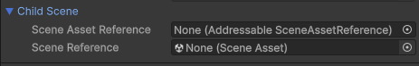

# コンテクスト空間

コンテクスト空間とは、DIフレームワークが扱う対象となるオブジェクトや、DIコンテナによって生成されたインスタンスを括ったものです。
コンテクスト空間は、シーンやゲームオブジェクトに対して定義されます。

## シーンコンテクスト空間

シーン全体が一つの大きなコンテクストとなります。
シーンをコンテクストとして扱う場合は、```ContextEntryPoint``` をシーンに配置するか、```SceneContextLoader``` を経由して別のシーンをロードします。

## ゲームオブジェクトコンテクスト空間

あるゲームオブジェクトを起点として、ヒエラルキ上の子全体をコンテクスト空間に包み込みます。
ゲームオブジェクトをコンテクストとして扱う場合は、```GameObjectContext``` をそのルートに配置します。

## DI Context Tree でコンテクスト空間の構造を確認する

ランタイムでコンテクスト空間がどのような構造を持っているか、また、各コンテクストに属する DI コンテナの状態を確認することができます。

Unity のメニューから、```Window > Doinject > DI Context Tree``` を選択してください。
以下のような Window が表示され、コンテクストの種類と親子関係を確認できます。


それぞれのコンテクストを選択すると、そのコンテクストに属する DI コンテナの状態を確認できます。

Bindinds タブでは、DI コンテナに登録されている型とインスタンスの提供方法を確認できます。

Instances タブでは、DI コンテナによって生成されたインスタンスを確認できます。AsTransient や、Factory で生成されたインスタンスは、
DIコンテナの管理から外れるためここでは表示されません。

## コンテクストの親子関係

コンテクストが親子関係を持つ場合、子コンテクストは親コンテクストに属する DI コンテナを参照することができます。
親コンテクストに登録された型やインスタンスは、子コンテクストから参照することができますが、その逆はできないので注意してください。

Application 全体を覆うシーンコンテクストを作成し、サービスロケーターパターンやシングルトンパターンで実現されていた、設計上グローバルなアクセスを必要とするオブジェクトをバインドし、
子のコンテクストでは、そこで必要とする最小限のバインドをする、といった構成をとることで、コンテクスト境界を明確にすることができます。

## コンテクストのライフサイクル

コンテクスト空間は好きなタイミングで閉じることができます。
シーンコンテクストであればシーンを閉じたタイミングで、ゲームオブジェクトコンテクストであればそのゲームオブジェクトを破棄したタイミングで解放されます。
`SceneContext.Dispose()` `GameObjectContext.Dispose()` を呼び出すことで、明示的にコンテクストを閉じることもできます。

もし、閉じたコンテクスト空間に属するインスタンスがあった場合、そのインスタンスは自動的に破棄されます。
ただし、ファクトリ経由で生成したインスタンスや ```AsTransient``` でバインドされたインスタンスは、破棄されない可能性があるので注意してください。

>[!NOTE]
> シーンコンテクストの場合、シーンを閉じるということは、そのシーンのヒエラルキにぶら下がるインスタンスもすべて破棄されるということですので、
> ほとんどのケースでは問題がありませんが、別のシーンにインスタンスを移動させたり、ゲームオブジェクトコンテクストのヒエラルキの外側にインスタンスを移動させたりする場合は、
> そのインスタンスの破棄は自分で行う必要があります。

Doinject はこのように、Unity のライフサイクルと矛盾しないコンテクスト空間を持つことをコンセプトとして設計されています。

## 子コンテクストの生成 - シーンコンテクスト

シーンコンテクスト、ゲームオブジェクトコンテクストを起点に、子となるコンテクストを生成することができます。

### シーンロードを経由して子コンテクストを生成する

各コンテクスト空間に属する DIコンテナには、必ず `SceneContextLoader` が提供されます。
`SceneContextLoader` を経由して、別のシーンをロードすることで、子どもとなるシーンコンテクストを生成することができます。
`SceneContextLoader` をインジェクトしてインスタンスを獲得し、`LoadAsync` を呼び出すことで、子シーンをロードすることができます。

子コンテクストとなるシーンを、ロードするコンポーネントを作ってみましょう。

```csharp
public class LoadChildScene : MonoBehaviour, IInjectableComponent
{
    [SerializeField] UnifiedScene childScene;

    [Inject]
    public async Task Construct(SceneContextLoader sceneContextLoader)
    {
        await sceneContextLoader.LoadAsync(childScene, active: true);
    }
}
```

このコンポーネントを、シーンに配置し、childScene に利用可能なシーンを指定することで、
そのシーンをロードすることができます。

#### UnifiedScene について

`SceneContextLoader.LoadAsync` の第一引数には、`UnifiedScene` 型を指定します。
`UnifiedScene` は、BuildSettings を経由したシーンと、Addressalbes を経由したシーンの
複数のシーン指定方法を透過的に扱うために用意されています。

SerializeField　に UnifiedScene を指定すると、インスペクタで以下のように表示されます。
(Addressables パッケージがプロジェクトに導入されている場合)



BuildSettings にて指定されているシーン(```SceneReference```)か、
Addressables に登録されているシーン(```SceneAssetReference```)のいずれかを指定することで、
異なるローディング方法のシーンを透過的に扱うことができます。
二つとも指定されている場合は、```SceneAssetReference``` が優先されます。

>[!NOTE]
> Addressables パッケージを導入していないプロジェクトの場合は、SceneReference のみ表示されます。

>[!NOTE]
> Addressables 管理のシーンしか扱わないプロジェクトの場合は、SceneAssetReference を直接使っても問題ありません。
> 同様に BuildSettings で指定されたシーンしか扱わない場合は、SceneReference を使ってもシーンのロードが可能です。
> しかしながら、基本的には UnifiedScene を使うことをおすすめします。

#### 動作確認

```LoadChildScene``` を EntryPoint となるシーンに配置したら、実行してみましょう。
EntryPoint となるシーンがロードされると、子シーンがロードされることが確認できます。

DI Context Tree を確認すると、親子関係を持ったシーンコンテクストが生成されていることが確認できます。

## 子コンテクストの生成 - ゲームオブジェクトコンテクスト

次にゲームオブジェクトコンテクストを子のコンテクストとして動作させてみましょう。

エントリポイントとなるシーンに以下のようにゲームオブジェクトを配置します。


この例では、GameObjectContext という名前のノードがコンテクスト空間のルートとなり、子オブジェクトはすべてコンテクスト空間に包まれ、
シーンコンテクストと同様に、インストーラーや必要なコンポーネントを自由に配置することができます。

まずは、ルートに GameObjectContext コンポーネントをアタッチします。


以上で、ゲームオブジェクトコンテクストの設定は完了です。
動作を確認すると、コンテクストツリーの状態が以下のようになっていることが確認できます。


シーンコンテクストの子として、ゲームオブジェクトコンテクストが生成されていることが確認できます。
また、ゲームオブジェクトコンテクスト内に配置したインストーラの定義に従ったバインディングが行われていることも確認できます。

### ゲームオブジェクトコンテクストのライフサイクル

このゲームオブジェクトコンテクストをプレハブ化し、再生中のシーンコンテクストにドラッグ＆ドロップすることで、
ゲームオブジェクトコンテクストがリアルタイムに生成されることが DI Context Tree Window で確認できます。

また、ヒエラルキビュー上でコンテクストルートを削除すると、
リアルタイムにコンテクストが破棄されることが、同様に DI Context Tree Window で確認できます。

このように、ゲームオブジェクトコンテクストは、Unity のライフサイクルと矛盾せず、開発中のデバッグがしやすいように設計されています。

ダイアログとして機能するUIの挙動を確認したいときなど、小さなコンテクストを持つモジュールを開発するとき、ゲームオブジェクトコンテクストは有用です。

## コンテクストを閉じる

コンテクストに対して Dispose を呼び出すことで、コンテクストを閉じることができます。

```csharp
public IContext Context { get; set; }

[Inject]
public void Construct(IContext context)
{
    Context = context;
}

public async Task DisposeSceneContext()
{
    Context.Dispose();
}
```

シーンコンテクストの場合は、シーンをロードした際に、SceneContext を保持しておくことで、そのコンテクストを閉じることができます。

```csharp
var sceneContext = await sceneContextLoader.LoadAsync(firstScene, active: true);
...
await sceneContextLoader.UnloadAsync(sceneContext);
```

> [!NOTE]
> これ以外の方法で直接シーンを閉じたときでも、シーンコンテクスト自体は自動的に閉じられますが、
> Addressables でロードしたシーンをアンロードする場合は、そのハンドルが解放されなくなってしまうので、必ず、シーンローダーを使うか、コンテクストの破棄をするようにしてください。


ゲームオブジェクトコンテクストがアタッチされたオブジェクトを破棄すると、そのコンテクストは閉じます。

```csharp
Destroy(gameObjectContext);
```


## シーンを切り替える

シーンを切り替えるには、エントリポイントとなるシーンのコンテクストで、```SceneContextLoader``` をインジェクトして、
```UnloadAllScenesAsync()``` ```LoadAsync()``` を呼び出します。

```csharp
await sceneContextLoader.UnloadAllAsync();
await sceneContextLoader.LoadAsync(nextScene, active: true);
```

特定のシーンをアンロードするには、```LoadAsync()``` の戻り値を保持しておき、
必要なタイミングで ```UnloadAsync()``` を呼び出します。

```csharp
var sceneContext = await sceneContextLoader.LoadAsync(firstScene, active: true);
...
await sceneContextLoader.UnloadAsync(sceneContext);
await sceneContextLoader.LoadAsync(nextScene, active: true);
```

### 自身のシーンコンテクストを破棄して、別のシーンを呼び出す

```csharp

[SerializeField] public SceneAssetReference nextSceneAssetReference;

public IContext Context { get; set; }

void Constrruct(IContext context)
{
    Context = context;
}

public void LoadNextScene()
{
    await Context.OwnerSceneContextLoader.UnloadAllScenesAsync();
    await Context.OwnerSceneContextLoader.LoadAsync(nextSceneAssetReference, active: true);
}
```

自身の属するコンテクストを取得し、そのコンテクストの ```OwnerSceneContextLoader``` を経由して、
シーンを切り替えることができます。
エントリポイントコンテクストには、```OwnerSceneContextLoader``` が提供されていないので注意してください。


>[!NOTE]
> 一応、こういうこともできるという紹介で、この書き方が推奨できるかは微妙です。
> ここで紹介した記述を組み込んだ、アプリケーションの機構に適したにシーン管理クラスを用意するのが良いでしょう。
> シーン管理クラスをコンテクストにバインドして、子のコンテクストからも、シーン管理機能を通してシーンを切り替えるようにすると見通しが良くなります。

## 補足

注意点としては、Doinject では、プロジェクト全体を表現するコンテクスト空間は今のところ予定していません。
現時点ではマルチシーンによるコンテクストの親子関係を利用した設計を推奨しています。
