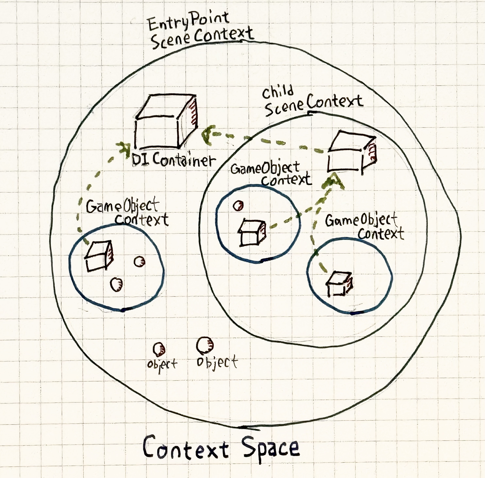

# コンテクスト空間

コンテクスト空間とは、DIフレームワークが扱う対象となるオブジェクトや、DIコンテナによって生成されたインスタンスを括ったものです。
コンテクスト空間は、シーンやゲームオブジェクトに対して定義されます。

{width=500px}

## シーンコンテクスト空間

シーン全体を一つの大きなコンテクストで包みます。シーンコンテクストが生成されるのは以下の場合です。

* ```ContextEntryPoint``` コンポーネントをシーンに配置した場合、そのシーンはコンテクストに包まれます。
* ```SceneContextLoader``` を経由して別のシーンをロードすると、そのシーンは新たなコンテクストを生成します。


## ゲームオブジェクトコンテクスト空間

あるゲームオブジェクトを起点として、ヒエラルキ上の子全体をコンテクスト空間に包み込みます。
ゲームオブジェクトのツリーをコンテクストとして扱う場合は、```GameObjectContext``` をそのルートに配置します。

* あらかじめシーンに配置しておく
* コンテクスト空間内に動的に配置する

いずれのケースでもゲームオブジェクトコンテクスト空間が生成されます。

## コンテクストの親子関係

コンテクストが親子関係を持つ場合、子コンテクストは親コンテクストに属する DI コンテナを参照することができます。
親コンテクストに登録された型やインスタンスは、子コンテクストから参照することができますが、その逆はできないので注意してください。

Application 全体を覆うシーンコンテクストを作成し、サービスロケーターパターンやシングルトンパターンで実現されていた、設計上グローバルなアクセスを必要とするオブジェクトをバインドし、
子のコンテクストでは、そこで必要とする最小限のバインドをする、といった構成をとることで、コンテクスト境界を明確にすることができます。

## コンテクストのライフサイクル

コンテクスト空間は好きなタイミングで閉じることができます。
シーンコンテクストであればシーンを閉じたタイミングで、ゲームオブジェクトコンテクストであればそのゲームオブジェクトを破棄したタイミングで解放されます。
`SceneContext.Dispose()` `GameObjectContext.Dispose()` を呼び出すことで、明示的にコンテクストを閉じることもできます。

もし、閉じたコンテクスト空間に属するインスタンスがあった場合、そのインスタンスは自動的に破棄されます。
ただし、ファクトリ経由で生成したインスタンスや ```AsTransient``` でバインドされたインスタンスは、破棄されない可能性があるので注意してください。

>[!NOTE]
> シーンコンテクストの場合、シーンを閉じるということは、そのシーンのヒエラルキにぶら下がるインスタンスもすべて破棄されるということですので、
> ほとんどのケースでは問題がありませんが、別のシーンにインスタンスを移動させたり、ゲームオブジェクトコンテクストのヒエラルキの外側にインスタンスを移動させたりする場合は、
> そのインスタンスの破棄は自分で行う必要があります。

Doinject はこのように、Unity のライフサイクルと矛盾しないコンテクスト空間を持つことをコンセプトとして設計されています。

## シーンや、ゲームオブジェクトコンテクストの子に、あらかじめ配置したコンポーネントへの注入

シーンやゲームオブジェクトコンテクスト以下にあらかじめ配置されているコンポーネントへ依存を注入するためには、
```MonoBehaviour``` を継承したコンポーネントが ```IInjectableComponent``` インターフェースを継承している必要があります。

```csharp
public class SomeComponent : MonoBehaviour, IInjectableComponent // IInjectableComponent を継承する
{
    [Inject] // [Inject] 属性をつける
    public void Construct(SomeDependency dependency)
    {
        ...
    }
}
```

> [!NOTE]
> シーンのコンポーネントすべてを調査するのはコストがかかるため、このような制約をおいています。
