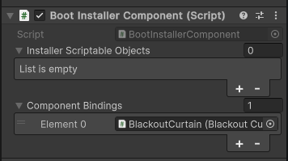

# インストーラー

DIコンテナに解決してもらう型やその解決方法を指定するためには、インストーラーを利用します。

インストーラーは、コンテクストとなるシーン、もしくは、ゲームオブジェクトコンテクストにコンポーネントとして配置することで、
そこに記述されたバインディングを DI コンテナに登録することができます。 また、ScriptableObject としてインストーラーを作成することもできます。

## コンポーネントとしてインストーラーを作る

コンポーネントとしてインストーラーを作成する場合は、以下の手順に従ってください。

### インストーラスクリプトの作成

インストーラは、`Doinject` メニューから作成することができます。Project ビューで右クリックし、
`Create` > `Doinject` > `Binding Installer Component C# Script` を選択することで、 インストーラスクリプトが作成されます。


CustomComponentBindingInstallerScript.cs という名前でスクリプトを作成した場合、以下のようなスクリプトが作成されます。

```csharp
using Doinject;

public class CustomComponentBindingInstallerScript : BindingInstallerComponent
{
    public override void Install(DIContainer container, IContextArg contextArg)
    {
        base.Install(container, contextArg);
        // Bind your dependencies here
    }
}
```

```Install()``` 内に、バインディングを記述していきます。


### インストーラーコンポーネントをインストールする

インストーラーコンポーネントは、コンテクストエントリポイントの存在するシーンや、シーンローダーを経由してロードされるシーンにあらかじめ配置しておくか、
ゲームオブジェクトコンテクストの子として配置することで、コンテクストの開始時に自動的にインストールされます。


## ScriptableObject としてインストーラーを作る

ScriptableObject としてインストーラーを作成する場合は、以下の手順に従ってください。

### インストーラスクリプトの作成

ScriptableObject としてインストーラーを作る場合は、`Doinject` メニューから作成することができます。Project ビューで右クリックし、
`Create` > `Doinject` > `Binding Installer ScriptableObject C# Script` を選択することで、 インストーラスクリプトが作成されます。


CustomBindingInstallerScriptableObjectScript という名前でスクリプトを作成した場合、以下のようなスクリプトが作成されます。

```csharp
using Doinject;
using UnityEngine;

[CreateAssetMenu(menuName = "Doinject/Installers/CustomBindingInstallerScriptableObjectScript", fileName = "CustomBindingInstallerScriptableObjectScript", order = 0)]
public class CustomBindingInstallerScriptableObjectScript : BindingInstallerScriptableObject
{
    public override void Install(DIContainer container, IContextArg contextArg)
    {
    }
}
```
```Install()``` 内に、バインディングを記述していきます。

### ScriptableObject アセットの作成

ここで作成された ScriptableObject は、Project ビュー内で右クリックをし、
`Create` > ```Doinject``` > ```Installers``` に表示され、選択することで ScriptableObject のアセットを作成することができます。

### ScriptableObjectInstaller をインストールする

インストーラーコンポーネントには、以下のように インストーラーの ScriptableObject を設定することができます。


## 空のインストーラーコンポーネントを作成する

ScriptableObject として作成されたインストーラーだけ使用するコンテクストでは、
インストーラーコンポーネントを新規に作らず、空のインストーラーを配置するだけで十分かもしれません。

ヒエラルキビューで右クリックをして、```Doinject``` -> ```Create Installer``` を選択することで、
空のインストーラーコンポーネントを作成することができます。
ここで作成された空のインストーラーを使っても、ScriptableObject インストーラーを設定することができます。


## Unity オブジェクトとの連携

### シーンに配置済みのコンポーネントをバインドする

インストーラーのインスペクタ内には、```Component Bindings``` という項目があります。
ここに、シーンに配置されたコンポーネントをドラッグ＆ドロップすることで、インストーラースクリプトを記述することなく、
そのコンポーネントをバインドすることができます。




### SerializeField を活用する

インストーラーの実態は、```MonoBehaviour``` もしくは ```ScriptableObject``` ですので、[SerializeField] プロパティを通じて、
他のオブジェクトを参照することができます。

Unity のオブジェクトを参照することで、それらをバインドすることができ、
プレハブの指定や、他のスクリプタブルオブジェクトのバインドができるようになっています。

```AssetReference``` や ```PrefabAssetReference``` を参照すれば ```Addressables``` で管理されたアセットをバインドすることもできます。

```csharp
public class SomeInstaller : BindingInstallerComponent
{
    [SerializeField] PrefabAssetReference prefabAssetReference;

    public override void Install(DIContainer container, IContextArg contextArg)
    {
        base.Install(container, contextArg);
        // Bind your dependencies here
        container.BindPrefabAssetReference<SomeComponent>(prefabAssetReference);
    }
}
```
