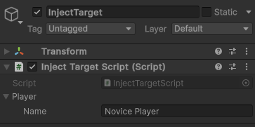

# Doinject をはじめよう

## インストール

### Unity Package Manager でインストール

Unity Package Manager からインストールすることができます。

### MewCore のインストール

まず、依存ライブラリとなる、MewCore パッケージをインストールしてください。

1. Unity のメニューから `Window` > `Package Manager` を選択します。
2. `+` ボタンをクリックし、`Add package from git URL...` を選択します。
3. 以下を入力し、`Add` をクリックします。
```
git@github.com:mewlist/MewCore.git
```

### Doinject のインストール

次に、Doinject パッケージをインストールします。

1. Unity のメニューから `Window` > `Package Manager` を選択します。   
2. `+` ボタンをクリックし、`Add package from git URL...` を選択します。
3. 以下を入力し、`Add` をクリックします。
```
git@github.com:mewlist/Doinject.git
```

## エントリポイントを決める

最初にすべきことは、DIフレームワークを適用したいシーンを開き、ヒエラルキにエントリポイントとなるコンポーネントを配置することです。

エントリポイントコンポーネントは、`ContextEntryPoint` という名前で、`Doinject` メニューから作成することができます。


配置されたコンテクストエントリポイント


これで、このシーンは DI フレームワークの実行環境として機能するようになりました。
試しに一度再生してみてください。


シーンが再生されると、このように自動的に SceneContext が生成されます。
SceneContext　は、フレームワークにより自動的に生成されるものですので、シーンには配置しないようにしてください。

>[!NOTE]
> Doinject は、「コンテクスト空間」内でのみ、その機能へアクセスできます。
> 「コンテクスト空間」は、シーンやゲームオブジェクトに対して定義されます。また、ゲームオブジェクトコンテクストはヒエラルキの階層に従った空間を持ちます。
> コンテクストにはそれぞれ DIコンテナや、シーンローダーがぶら下がっており、DI フレームワークの実行環境として機能します。

## 初めてのインジェクション

DIコンテナにインスタンスを登録して、インジェクションを行ってみましょう。
インスタンスの登録(バインディングと言います)はインストーラというコンポーネントから行います。

### インストーラスクリプトの作成

インストーラは、`Doinject` メニューから作成することができます。Project ビューで右クリックし、
`Create` > `Doinject` > `Component Binding Installer C# Script` を選択することで、 インストーラスクリプトが作成されます。


CustomComponentBindingInstallerScript.cs という名前でスクリプトを作成した場合、以下のようなスクリプトが作成されます。

```csharp
using Doinject;

public class CustomComponentBindingInstallerScript : BindingInstallerComponent
{
    public override void Install(DIContainer container)
    {
        // Bind your dependencies here
    }
}
```

また、動作を確認するため、DIコンテナに登録するオブジェクトと注入先のスクリプトを以下のように作成します。

#### プレイヤーオブジェクト
```csharp
using System;
using UnityEngine;

[Serializable]
public class Player
{
    [SerializeField] public string name;
    public Player(string name)
    {
        this.name = name;
    }
}
```

#### 注入先スクリプト
```csharp
using Doinject;
using UnityEngine;

public class InjectTargetScript : MonoBehaviour, IInjectableComponent
{
    [SerializeField] private Player player;

    [Inject] public void Construct(Player player)
    {
        this.player = player;
    }
}
```

Player オブジェクトのインスタンスが`InjectTargetScript.Construct()` を通じて
インジェクトされることがゴールとなります。

> [!NOTE]
> MonoBehaviour を継承し、コンポーネントとして定義される型は、IInjectableComponent を継承する必要があります。
> また、[Inject] 属性をつけた、注入先のメソッドは public である必要があります。

では、インストーラーにバインディングを記述していきましょう。
バインディングは、Install メソッド内で行います。

```csharp
    public override void Install(DIContainer container)
    {
        container
            .Bind<Player>()
            .Args("Novice Player")
            .AsSingleton();
    }
```

`.Bind<Player>()` は、Player クラスをコンテナを通じて提供してもらうための宣言です。

`.Args("Novice Player")` は、Player クラスのコンストラクタにわたす引数となります。

`.AsSingleton()` は、コンテナを通じて提供される Player オブジェクトがシングルトンであることを示します。

バインド記述は、此のように Fluent Interface を通じて行います。
記述の仕方により、ファクトリとして振る舞ったり、インターフェースを介してインスタンスを提供してもらうようにしたりと柔軟な振る舞いの定義ができます。

> [!NOTE]
> 便宜上 Singleton という用語をつかっていますが、あくまでもコンテクスト空間内で唯一という概念を表しています。
> シングルトンパターンとは異なり、コンテクストの境界を超えてインスタンスが共有されることはありません。


これで、コンテクスト内で唯一となる Player オブジェクトが、DIコンテナに登録されました。

最後に、インストーラーをシーンに配置しましょう。


コンポーネントインストーラーは、基本的にシーンのどこに置いてあっても機能します。
また、複数の異なるインストーラーがあっても構いません。
わかりやすさのため、エントリポイントの下に置くなどルールを決めておくのが良いでしょう。

### 動作確認

先程つくった、InjectTargetScript コンポーネントを、シーンに配置しましょう。


では、シーンを再生してみます。



Player の Name に "Novice Player" という文字列が設定されていることが確認できます。

Player のコンストラクタに Args で指定した引数が渡り(コンストラクタインジェクション)、
さらに、InjectTargetScript の Construct メソッドに Player オブジェクトが渡ったことが確認できました(メソッドインジェクション)。

> [!NOTE]
> このとき、DIコンテナの内部では以下のような処理が行われていると考えて良いでしょう。
> ```csharp
> var arg = "Novice Player";
> var player = new Player(arg);
> var injectable = Object.FindComponents(typeof(IInjectableComponent)).First();
> (injectable as InjectTargetScript).Construct(player)
> ```

ちなみに、DI により生成されるインスタンスは、そのコンストラクタに自動的に依存注入を試みるため、[Inject]　属性は不要です。
明示的に [Inject] 属性をつけても問題はありませんが、その属性定義に依存してしまうことを考慮に入れる必要があります。

### 動作確認の補足

シーン全体に配置されたオブジェクトは、すべてシーンコンテクストに包まれます。
* シーンコンテクストは、生成時に、自身のコンテクストに属するインストーラーを探し、それらの定義に従ってバインディングを行います。
* すべてのインストーラーのバインディングが完了すると、DIContainer は自身が扱うべき型とインスタンス解決方法を知っている状態となります。
* その後、シーンコンテクストは、シーン内のすべてのゲームオブジェクトを探索し、IInjectableComponent を実装したコンポーネントを探します。
* IInjectableComponent を実装したコンポーネントが見つかったら、そのコンポーネントの [Inject] 属性が指定されたメソッドの引数と型の一致するインスタンスを渡すよう呼び出します。
* シーンコンテクストは、シーンのライフサイクルに合わせて生成され、シーンが破棄されると同時に、コンテナが抱えるインスタンスとともに破棄されます。

