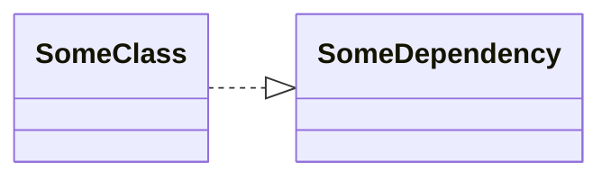

# About DI Frameworks

Doinject is a framework for implementing applications using a DI container.

DI stands for Dependency Injection, which means injecting dependencies. This is achieved using a component called a DI container.

To understand the DI framework, it's important to understand the following two points:

* Inversion of Control
* Dependency Inversion

Let's take a quick look at these concepts.


Suppose you have the following code:

```C#
class SomeClass
{
    private readonly SomeDependency dependency;
    public SomeClass()
    {
        var context = ContextManager.Instance.Get();
        var playerName = PlayerRepository.Instance.GetPlayer().Name;
        dependency = new SomeDependency(context, playerName);
    }
}
```

SomeClass is creating a new instance of SomeDependency in its constructor, which means SomeClass depends on SomeDependency.



SomeClass needs to know not only about SomeDependency but also how to create it. If there are other classes that require SomeDependency, they will likely have to write similar creation processes as written here.

If the creation process of SomeDependency changes later on, you will need to modify each copied code one by one. This would be a painful situation.

Therefore, let's leave the instance creation of SomeDependency to someone else. Instead of creating a new instance, try to receive it as an argument to the constructor.

```C#
class SomeClass
{
    private readonly SomeDependency dependency;
    public SomeClass(SomeDependency dependency)
{
        this.dependency = dependency;
    }
}
```

It's much cleaner. This practice of receiving dependent objects from outside rather than creating new ones is referred to as Dependency Injection.

> Receiving instances in the constructor is called "constructor injection"
> Receiving instances through methods is called "method injection".

As you can see, using a DI framework can serve as a factory, for example.

## Inversion of Control

The code that was "calling" new to get an instance, now gets an instance by the constructor being "called". This transition from "calling" to being "called" is referred to as Inversion of Control, and is a key feature of DI frameworks.

## Dependency Inversion

DI is also used to implement the Dependency Inversion Principle. Although the previous code inverted control, it didn't change the fact that there is a dependency on SomeDependency. Next, let's modify the dependency between these classes.

Consider the following example.

```C#
public class SomeDependency
{
    public void DoSomething()
    {
        Debug.Log("DoSomething");
    }
} 

class SomeClass
{
    public SomeClass(SomeDependency dependency)
    {
        dependency.DoSomething();
    }
}
```


SomeClass is dependent on SomeDependency. By introducing an interface named ISomeDependency, it can be rewritten as follows:

```C#
public interface ISomeDependency
{
    void DoSomething();
} 

public class SomeDependency : ISomeDependency
{
    public void DoSomething()
    {
        Debug.Log("DoSomething");
    }
} 

class SomeClass
{
    public SomeClass(ISomeDependency dependency)
    {
        dependency.DoSomething();
    }
}
```

Looking at this change through a class diagram, it becomes as follows:

{type="narrow" sorted="desc"}
Before the change
: ```mermaid
classDiagram
direction LR
    SomeClass ..|> SomeDependency
```

After the change
: ```mermaid
classDiagram
direction LR
    SomeClass ..|> ISomeDependency
    ISomeDependency <|.. SomeDependency
```

If you look at them side by side, you'll notice that the direction of the arrow entering SomeDependency has reversed. This state is referred to as Dependency Inversion. By changing the dependency from concrete (SomeDependency) to abstract (ISomeDependency), the direction of dependency is inverted.

The benefits gained from this are as follows:

### Improved Testability

SomeClass can now accept any type that implements ISomeDependency, and in testing, you can pass a mock object instead of depending on the implementation of SomeDependency. As a result, the testability of the module is improved.

### Loosening of Module Coupling

SomeClass is less likely to be affected by changes in SomeDependency. You can design by dividing into modules, making it easier to add or change functions, and improving overall maintainability.

In fact, if you imagine a situation where SomeClass, ISomeDependency, and SomeDependency are each defined in separate dlls, you can see that changes to SomeDependency do not require SomeClass to be recompiled.

### Improved Reusability

SomeClass can now accept any type that implements ISomeDependency, which can be said to have increased reusability.

By using DI, you can eliminate dependencies on concrete classes in this way and achieve Dependency Inversion.

> With this in mind, you might be tempted to avoid dependencies on concrete classes to the extreme, but that's not to say that dependencies on concrete classes are bad. The DI container does nothing more than provide instances of the types it depends on. With that in mind, it's a good idea to consider whether a dependency on an abstraction is really necessary, considering requirements like "I want to ensure testability", "I want to handle instances with polymorphism", and "I want to eliminate dependencies between modules".
{style="note"}

You should be ready to use the DI framework...!
Now, let's look at how to use Doinject.